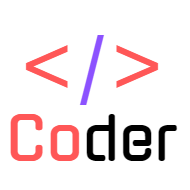

# Coder

**一款聚合资讯app，全部数据采集自官方API**

为什么叫这个名字呢，我也没有什么想象力，女朋友叫Coco，然后就想到了这个名字，好像没有什么必然联系？hahahahaha~
目前功能包括**掘金开发者社区**，**知乎推荐**，和一个**隐藏功能**比较适合程序员边 ~~学习成长~~ 边吹水。

## 掘金

#### 为什么选择掘金？

这里要吐槽一手了，刚入行的时候我想大多数人都是遇到问题 > 打开baidu > 啊看到一条结果的标题正合我意 > 打开看一下哦还行 >记住这个网站了CSDN，后来深入学习了，遇到问题 > 打开baidu > 啊看到一条结果的标题正合我意 > 打开看一下不行 > 再看一条哎？卧槽这跟上篇一样啊 > 再看一条哎？卧槽这跟上篇一样啊 > 再........

CSDN不知道是什么机制，没有兴趣去了解了，催生了一大批copyer作者，复制粘贴完全不带自己思考，关键是有很多还是错误的，或者更有甚者打开文章就是一条链接，指向另一个网站，我寻思你自己添加到收藏他不香吗？

掘金的出现，干净利落，目前使用过程中，没有发现大量的复制粘贴，而且入驻了很多大厂的官方团队，比如昨天刷到一篇文章是网易云音乐团队，这名字就是质量的保障。UI方面，整体清新淡雅，扁平化设计，文章内容就是重点。

所有API采集自掘金web站，最初先网上冲浪搜索一下有没有前辈做过，嘿还真的搜到一个[myvin-juejin](https://github.com/myvin/juejin "myvin-juejin")，主要是因为当初做网易云音乐第三方客户端的时候发现网易云对每一次api请求都加密了，但是咱也不知道他咋加密的......怕掘金也这样所以就先看看有没有前辈讲解加密方案的，得，掘金不加密，就是基本的token认证，headers带认证信息，正文都是明文传输，那我直接去扒[掘金官网](https://juejin.im "掘金官网")吧。

#### 正经内容

官网用到很多的一个api：https://web-api.juejin.im/query ，可以查询分类文章列表，查询tag列表，查询关注作者的更新文章列表。

这样的api设计，采用了Facebook在2015年开源的一套API查询语言[GraphQL](https://graphql.org.cn/ "GraphQL")，现今的绝大多数Web Service都是RESTful的，也就是说，client和server的主要沟通模式还是靠client根据自己的需要向server的若干个endpoint (url)发起请求。由于功能的日渐丰富，对Web Application的要求变得复杂，REST的一些问题逐渐暴露。

Facebook设计了一套API查询语言，发送一个GraphQL的请求到你的API，可以精确地得到您想要的数据。 这些数据不会多也不会少。GraphQL的查询总是会返回可预期的结构。 使用GraphQL的App是非常迅速和稳定的。这得益于，它们可以自主控制数据，而不是服务器端来控制。GraphQL查询权限不但是资源的属性，而且平滑地遵守他们之间的指导关系。 当传统的REST类型的API从多个URL请求数据加载的时候， GraphQL的API仅仅需要从一个请求中就可以得到所有的数据。 使用GraphQL的应用即使在网络连接缓慢的时候，也会有较快的表现。

[mescroll](http://www.mescroll.com/index.html "mescroll")是一个精致的上拉加载下拉刷新的js库，更棒的是它还开发了[mescroll-uni](http://www.mescroll.com/uni.html?v=191101 "mescroll-uni")版本，提供了基础的上拉和下拉事件，一键回到顶部，上拉下拉加载中动画和已无更多数据的提示，支持配置各种占位图与显示动画，总之就是在UI与逻辑的结合上，省了我很多事情。
这里封装了多个mescroll-item，然后v-show控制显示，来达到缓存的目的，如果只用一个mescroll，更新DOM后滚动位置比较尴尬不太合理。

数据方面，想了一下，还是由外部传入，因为要用在首页分类文章列表和搜索结果文章列表展示，组件本身只负责UI和数据展示，如果组件自身要处理AJAX请求，组件未免太臃肿了。自身也只是处理了文章列表展示的UI，并提供了一个插槽，目前在首页分类下tag列表展示使用过。